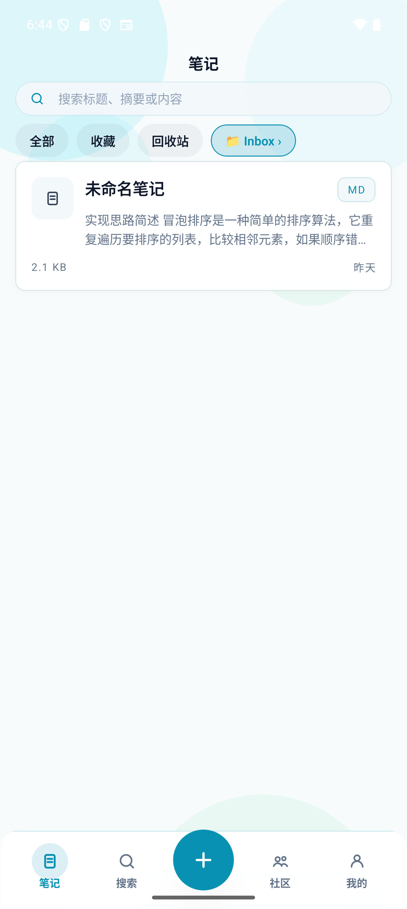
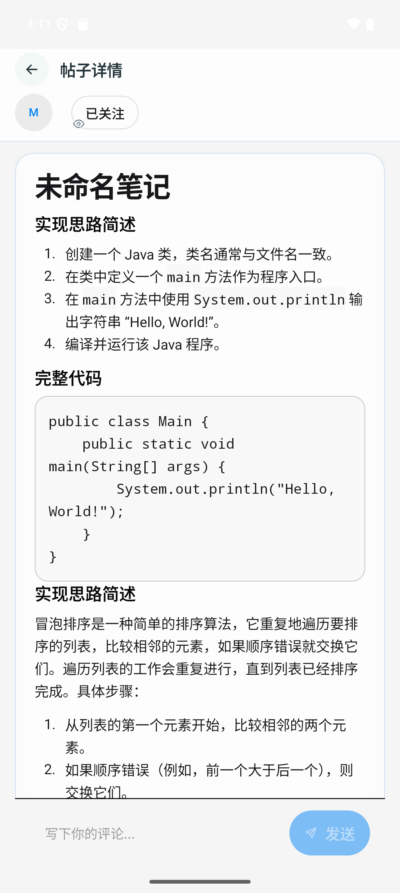
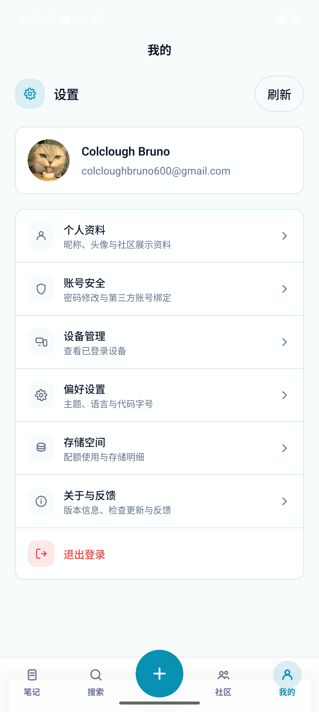
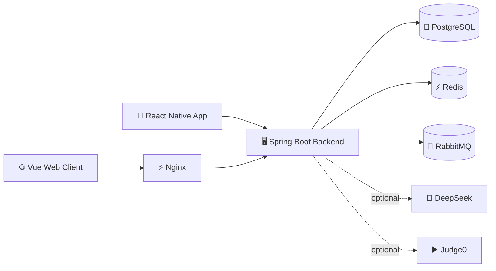

<div align="center">

English | [简体中文](README.zh-CN.md)

# ✨🚀 Snipxn 🚀✨

### 🎯 Developer Note Workspace · Community · AI · Multi-Client

<br/>

🌐 **Web** &nbsp;·&nbsp; 📱 **Mobile** &nbsp;·&nbsp; ☁️ **Offline Sync** &nbsp;·&nbsp; 🤖 **AI** &nbsp;·&nbsp; 👥 **Community**

<br/>

[](https://spring.io/projects/spring-boot)
[](https://vuejs.org/)
[](https://reactnative.dev/)
[](https://www.postgresql.org/)
[](https://www.docker.com/)

<br/>

🔥 Snipxn combines developer notes, public sharing, community interaction, AI tooling, and multi-client delivery in one repository. 🔥

</div>

---

## 🌟 Overview

Snipxn is a **full-stack multi-client project** instead of a single demo page. This repository contains:

- 🖥️ A **Spring Boot 4** multi-module backend for auth, notes, community, AI, sandbox, file upload, sync, and app version APIs
- 🌐 A **Vue 3** web client for landing, authentication, workspace, community, settings, and public share pages
- 📱 A **React Native** mobile client for note editing, search, community, settings, and offline-first synchronization
- 🐳 A **Docker Compose** deployment stack for PostgreSQL, Redis, RabbitMQ, backend, and the Nginx-served web frontend

> 💡 Snipxn is structured like a real product: notes, sync, sharing, community, account devices, AI tooling, and multi-client delivery all live in one repository.

## 🖼️ Preview

<table>
  <tr>
    <td align="center" width="33%">
      
      <br />
      <sub><b>📝 Workspace</b><br />Note list with search, filters & folders</sub>
    </td>
    <td align="center" width="33%">
      
      <br />
      <sub><b>💬 Community</b><br />Post detail with code blocks & comments</sub>
    </td>
    <td align="center" width="33%">
      
      <br />
      <sub><b>⚙️ Profile & Settings</b><br />Account, security, devices & preferences</sub>
    </td>
  </tr>
</table>

## 💎 Project Snapshot

| Focus | What it means in this repo |
| --- | --- |
| 📝 **Developer-first notes** | Folders, tags, starred notes, trash, sharing, import, and language-aware editing are already wired into the product flow. |
| 📱 **Multi-client delivery** | Vue web and React Native mobile clients share one backend contract instead of diverging into separate demo apps. |
| 👥 **Community layer** | Posts, comments, follows, profiles, public links, and engagement actions are implemented as first-class modules. |
| 🤖 **Tooling layer** | AI review/generate and Judge0 execution are connected as optional product capabilities rather than isolated experiments. |
| 🔄 **Offline sync** | Mobile app supports offline-first data flow with pull/push sync, local SQLite storage, and conflict-aware versioning. |
| 🔐 **Production-grade auth** | JWT device-aware rotation, email verification, GitHub & Google OAuth, and linked-account management. |

## 🚀 Implemented Capabilities

### 📝 Workspace

- 📁 Folder and tag management
- ✏️ Note CRUD, starred notes, trash, restore, and permanent delete
- 🖊️ Markdown/code editing with primary language metadata
- 📤 File upload and note import APIs
- 🔗 Public note sharing and public read-only note pages
- 📊 Storage breakdown API for note data
- 💻 Monaco-based editing flow on web

### 👥 Community

- 📰 Feed, hot posts, post detail, and user profile pages
- ✍️ Create and delete posts
- ❤️ Like, collect, and share posts
- 💬 Threaded comments and comment likes
- 🤝 Follow, followers, following, stats, and recommended users
- 🌍 Public read-only shared post pages

### 🔐 Authentication & Account

- 📧 Email registration, login, verification-code sending, and password reset
- 🔑 JWT access/refresh token flow with device-aware refresh
- 🐙 GitHub OAuth and 🔵 Google OAuth on web
- 📲 Google mobile login/binding flow for the mobile app
- 👤 Profile setup and profile update APIs
- 📋 Logged-in device management and linked-account management

### 🤖 AI & Code Sandbox

- 🧠 DeepSeek-backed code review and code generation endpoints
- ▶️ Judge0-backed code execution endpoint
- ⚡ Nginx API proxy configuration with SSE-friendly buffering disabled for AI responses

### 📱 Mobile App

- ⚛️ React Native 0.84 app with React 19 and TypeScript
- 💾 Local SQLite storage via `@op-engineering/op-sqlite`
- 🔄 Pull/push sync APIs and sync store for offline-first data flow
- 🔒 Secure token storage with `react-native-keychain`
- 📦 App version check endpoint for client update prompts

## 🏗️ Architecture

### 🔀 Delivery Flow



### 📂 Repository Layout

```text
Snipxn_System
├── 🖥️ snipxn-backend/              Spring Boot 4.0.3 multi-module backend
│   ├── 📦 snipxn-common/           Shared result types, exceptions, utilities
│   ├── 🔐 snipxn-auth/             Auth, JWT, OAuth, devices, linked accounts
│   ├── 📝 snipxn-note/             Notes, folders, tags, files, sharing, sync
│   ├── 👥 snipxn-community/        Posts, comments, follow system, public shares
│   ├── ▶️ snipxn-sandbox/          Judge0 execution integration
│   ├── 🧠 snipxn-ai/               DeepSeek integration
│   └── 🚀 snipxn-app/              Main app entry, Flyway, OpenAPI, config
├── 🌐 snipxn_frontend/             Vue 3.5 + Vite 7 web client
├── 📱 snipxn_app/                  React Native 0.84 mobile client
├── 🐳 docker-compose.yml           Full-stack deployment entry
├── 🔧 deploy.sh                    Deployment helper script
├── 🔒 .env.production              Docker deployment environment template
├── 📄 README.md                    English README
└── 📄 README.zh-CN.md              Chinese README
```

## 🛠️ Tech Stack

### 🖥️ Backend

| Layer | Stack |
| --- | --- |
| ☕ Runtime | Java 25, Spring Boot 4.0.3 |
| 🗄️ Data | PostgreSQL 17, Redis 7 |
| 📨 Messaging | RabbitMQ 4 |
| 💾 Persistence | MyBatis-Plus 3.5.15 |
| 🔐 Auth | Spring Security, JWT (`jjwt`) |
| 📋 Migration | Flyway |
| 📖 API Docs | SpringDoc OpenAPI |
| 📧 Mail | Spring Mail with Resend SMTP configuration |
| 🧠 AI | DeepSeek API |
| ▶️ Sandbox | Judge0 |

### 🌐 Web

| Layer | Stack |
| --- | --- |
| 🖼️ Framework | Vue 3.5 |
| ⚡ Build | Vite 7 |
| 🗃️ State | Pinia |
| 🎨 UI | PrimeVue 4, PrimeFlex, PrimeIcons |
| ✏️ Editor | Monaco Editor |
| 🌍 i18n | vue-i18n |

### 📱 Mobile

| Layer | Stack |
| --- | --- |
| ⚛️ Framework | React Native 0.84.1 + React 19 |
| 📘 Language | TypeScript 5.8 |
| 🗃️ State | Zustand |
| 🎨 UI | HeroUI Native |
| 💅 Styling | Tailwind CSS 4 + Uniwind |
| 💾 Local DB | `@op-engineering/op-sqlite` |
| 🔒 Storage/Security | AsyncStorage, Keychain |

### 🐳 Ops

| Layer | Stack |
| --- | --- |
| 📦 Containers | Docker Compose |
| ⚡ Web Serving | Nginx |
| 🌍 Edge/Delivery | Cloudflare-friendly reverse-proxy configuration |

## 🔧 Database & API Notes

- 📋 Flyway migrations live in `snipxn-backend/snipxn-app/src/main/resources/db/migration`
- 📖 The backend exposes Swagger UI at `http://localhost:8080/swagger-ui/index.html`
- 🔗 Public share APIs are exposed under `/api/v1/public/notes/{shareToken}` and `/api/v1/public/posts/{shareToken}`
- 📲 Mobile app version checks are exposed under `/api/v1/app/version/latest?platform=ANDROID` or `IOS`

## 🚀 Quick Start

### 📋 Prerequisites

- 🐳 Docker and Docker Compose
- ☕ Java 25
- 💚 Node.js 22.12+ recommended
- 📱 Android Studio and/or Xcode if you want to run the mobile app locally

### 🐳 Run The Full Stack With Docker

1️⃣ Prepare environment variables.

```bash
cp .env.production .env
```

2️⃣ Fill in the values you need in `.env`.

3️⃣ Start the stack.

```bash
docker compose up -d --build
```

4️⃣ Open the services.

- 🌐 Web: `http://localhost`
- 🖥️ API: `http://localhost:8080/api/v1`
- 📖 Swagger UI: `http://localhost:8080/swagger-ui/index.html`
- 🐇 RabbitMQ Management: `http://localhost:15672`

### 🖥️ Local Backend Development

The local backend development profile uses the variables in `snipxn-backend/.env.example`, including `DB_URL`, `DB_USERNAME`, and `DB_PASSWORD`. That naming is different from the production Docker template in the repository root.

1️⃣ Start infrastructure only.

```bash
docker compose up -d postgres redis rabbitmq
```

2️⃣ Export or configure the variables from `snipxn-backend/.env.example`.

3️⃣ Start the Spring Boot app from the backend root.

```bash
cd snipxn-backend
./mvnw -pl snipxn-app spring-boot:run
```

🪟 On Windows use:

```powershell
cd snipxn-backend
.\mvnw.cmd -pl snipxn-app spring-boot:run
```

### 🌐 Local Web Development

```bash
cd snipxn_frontend
npm install
npm run dev
```

The Vite dev server already proxies `/api` to `http://localhost:8080`. ✅

### 📱 Local Mobile Development

```bash
cd snipxn_app
npm install
npm start
```

🤖 Android:

```bash
npm run android
```

🍎 iOS:

```bash
bundle install
bundle exec pod install
npm run ios
```

> ⚠️ **Important:** In development, the mobile app defaults to `http://10.0.2.2:8080/api/v1` in `snipxn_app/src/api/axios.ts`, which matches the Android emulator loopback. If you use a real device or another simulator setup, update that base URL accordingly.

## 🌐 Environment Variables

The root `.env.production` file is the deployment template used by `docker-compose.yml`.

| Variable | Purpose | Required |
| --- | --- | --- |
| `DB_NAME` | 🐘 PostgreSQL database name | ❌ No |
| `DB_USER` | 🐘 PostgreSQL user | ❌ No |
| `DB_PASSWORD` | 🐘 PostgreSQL password | ✅ Yes |
| `REDIS_PASSWORD` | ⚡ Redis password | ✅ Yes |
| `RABBITMQ_USER` | 🐇 RabbitMQ user | ❌ No |
| `RABBITMQ_PASSWORD` | 🐇 RabbitMQ password | ✅ Yes |
| `JWT_SECRET` | 🔑 JWT signing secret | ✅ Yes |
| `CORS_ALLOWED_ORIGINS` | 🌍 Allowed web origins | ❌ No |
| `MAIL_API_KEY` | 📧 Mail provider API key | 🔶 Optional |
| `MAIL_FROM` | 📧 Sender address | 🔶 Optional |
| `GITHUB_CLIENT_ID` | 🐙 GitHub OAuth client ID | 🔶 Optional |
| `GITHUB_CLIENT_SECRET` | 🐙 GitHub OAuth client secret | 🔶 Optional |
| `GOOGLE_CLIENT_ID` | 🔵 Google OAuth client ID | 🔶 Optional |
| `GOOGLE_CLIENT_SECRET` | 🔵 Google OAuth client secret | 🔶 Optional |
| `JUDGE0_URL` | ▶️ Judge0 base URL | 🔶 Optional |
| `JUDGE0_API_KEY` | ▶️ Judge0 API key | 🔶 Optional |
| `DEEPSEEK_URL` | 🧠 DeepSeek base URL | 🔶 Optional |
| `DEEPSEEK_API_KEY` | 🧠 DeepSeek API key | 🔶 Optional |
| `DEEPSEEK_MODEL` | 🧠 DeepSeek model name, default `deepseek-v4-flash` | 🔶 Optional |
| `DEEPSEEK_MAX_TOKENS` | 🧠 DeepSeek max output tokens | 🔶 Optional |
| `DEEPSEEK_THINKING_ENABLED` | 🧠 Enable DeepSeek thinking mode | 🔶 Optional |
| `DEEPSEEK_REASONING_EFFORT` | 🧠 Thinking effort: `low`, `medium`, `high`, `max` | 🔶 Optional |
| `JAVA_OPTS` | ☕ JVM runtime options | ❌ No |

## 🔌 Optional Integrations

Some features in the repository depend on external services and are not started by the root Docker Compose file:

- 🧠 AI features require `DEEPSEEK_API_KEY`
- ▶️ Code execution requires a reachable `JUDGE0_URL`
- 📧 Email verification requires mail credentials
- 🐙 GitHub and 🔵 Google login require OAuth credentials

## 📄 License

This project is for educational purposes 🎓

---

<div align="center">

**⭐ Star this repo if you find it helpful! ⭐**

Made with ❤️ and lots of tokens

🌟 **Happy Coding!** 🌟

</div>
