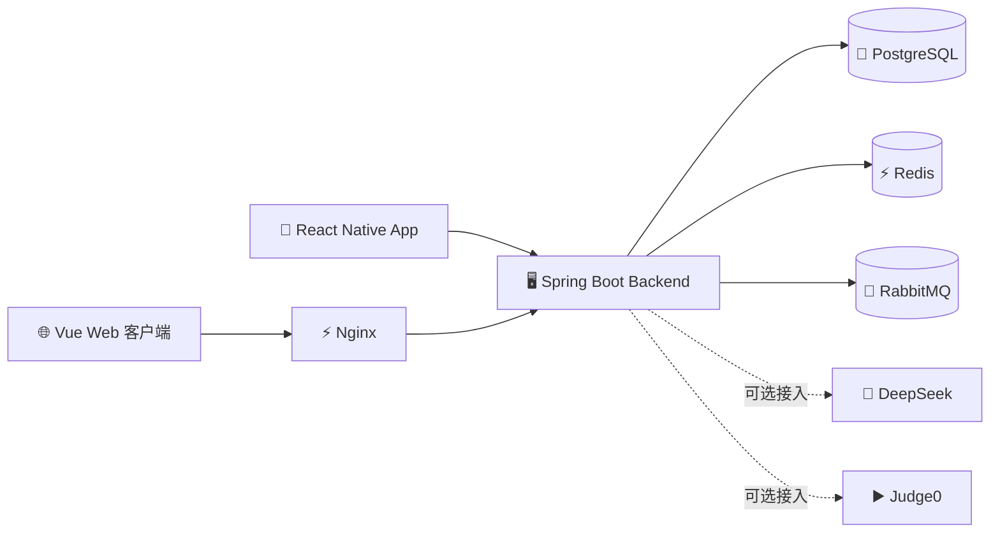

<div align="center">

[English](README.md) | 简体中文

# ✨🚀 Snipxn 🚀✨

### 🎯 面向开发者的笔记工作区 · 社区 · AI · 多端系统

<br/>

🌐 **Web 网页端** &nbsp;·&nbsp; 📱 **Mobile 移动端** &nbsp;·&nbsp; ☁️ **离线同步** &nbsp;·&nbsp; 🤖 **AI 助手** &nbsp;·&nbsp; 👥 **开发者社区**

<br/>

[](https://spring.io/projects/spring-boot)
[](https://vuejs.org/)
[](https://reactnative.dev/)
[](https://www.postgresql.org/)
[](https://www.docker.com/)

<br/>

🔥 Snipxn 把开发者笔记、公开分享、社区互动、AI 工具能力和多端交付统一放进了同一个仓库里。🔥

</div>

---

## 🌟 项目概览

Snipxn 不是单页演示，而是一个**完整的多端全栈项目**。当前仓库包含：

- 🖥️ 一个 **Spring Boot 4** 多模块后端，负责认证、笔记、社区、AI、代码沙箱、文件上传、同步和版本检查接口
- 🌐 一个 **Vue 3** Web 客户端，覆盖落地页、登录注册、工作区、社区、设置和公开分享页
- 📱 一个 **React Native** 移动端，覆盖笔记编辑、搜索、社区、设置以及离线优先同步
- 🐳 一套 **Docker Compose** 部署栈，包含 PostgreSQL、Redis、RabbitMQ、后端和由 Nginx 托管的 Web 前端

> 💡 Snipxn 现在更接近"真实产品仓库"而不是"课程演示页面"：笔记、同步、分享、社区、设备会话、AI 和多端交付都在同一个工程里。

## 🖼️ 界面预览

<table>
  <tr>
    <td align="center" width="33%">
      
      <br />
      <sub><b>📝 工作区</b><br />笔记列表、搜索、筛选与文件夹</sub>
    </td>
    <td align="center" width="33%">
      
      <br />
      <sub><b>💬 社区</b><br />帖子详情、代码块与评论区</sub>
    </td>
    <td align="center" width="33%">
      
      <br />
      <sub><b>⚙️ 个人中心</b><br />账号、安全、设备管理与偏好设置</sub>
    </td>
  </tr>
</table>

## 💎 项目亮点

| 方向 | 这个仓库已经做到什么 |
| --- | --- |
| 📝 **开发者笔记工作流** | 文件夹、标签、收藏、回收站、分享、导入和语言感知编辑都已经接入完整产品流程。 |
| 📱 **多端交付** | Vue Web 和 React Native App 复用同一套后端契约，而不是彼此割裂的演示页面。 |
| 👥 **社区层** | 帖子、评论、关注、个人主页、公开链接和互动行为都已经独立成模块。 |
| 🤖 **工具能力层** | AI 审查 / 生成与 Judge0 执行都已经作为可选产品能力接入，而不是零散试验代码。 |
| 🔄 **离线同步** | 移动端支持离线优先数据流，具备 pull/push 同步、本地 SQLite 存储和冲突感知版本控制。 |
| 🔐 **生产级认证** | JWT 设备维度轮换、邮箱验证、GitHub & Google OAuth、以及第三方账号绑定管理。 |

## 🚀 已实现能力

### 📝 工作区

- 📁 文件夹和标签管理
- ✏️ 笔记的新增、查询、编辑、删除、收藏、回收站、恢复和永久删除
- 🖊️ Markdown / 代码内容编辑，以及主语言元数据
- 📤 文件上传与笔记导入接口
- 🔗 笔记公开分享与公开只读页面
- 📊 笔记存储占用统计接口
- 💻 Web 端基于 Monaco Editor 的编辑体验

### 👥 社区

- 📰 动态流、热榜、帖子详情和用户主页
- ✍️ 发帖和删帖
- ❤️ 点赞、收藏、分享帖子
- 💬 多级评论与评论点赞
- 🤝 关注、粉丝、关注中、统计和推荐用户
- 🌍 帖子公开只读分享页

### 🔐 认证与账号

- 📧 邮箱注册、登录、验证码发送和重置密码
- 🔑 带设备维度的 JWT Access/Refresh Token 刷新机制
- 🐙 Web 端 GitHub OAuth 与 🔵 Google OAuth
- 📲 移动端 Google 登录 / 绑定流程
- 👤 首次资料设置和个人资料更新接口
- 📋 登录设备管理与第三方账号绑定管理

### 🤖 AI 与代码沙箱

- 🧠 基于 DeepSeek 的代码审查与代码生成接口
- ▶️ 基于 Judge0 的代码执行接口
- ⚡ Nginx 已配置 `/api` 反向代理，并关闭了 AI 响应相关的缓冲以兼容流式场景

### 📱 移动端特性

- ⚛️ 基于 React Native 0.84、React 19 和 TypeScript 的移动应用
- 💾 通过 `@op-engineering/op-sqlite` 实现本地 SQLite 存储
- 🔄 提供同步 `pull/push` 接口与本地同步状态管理
- 🔒 使用 `react-native-keychain` 安全保存登录凭证
- 📦 提供客户端版本检查接口，用于更新提示

## 🏗️ 系统架构

### 🔀 交付流转



### 📂 仓库结构

```text
Snipxn_System
├── 🖥️ snipxn-backend/              Spring Boot 4.0.3 多模块后端
│   ├── 📦 snipxn-common/           通用结果类型、异常、工具类
│   ├── 🔐 snipxn-auth/             认证、JWT、OAuth、设备、账号绑定
│   ├── 📝 snipxn-note/             笔记、文件夹、标签、文件、分享、同步
│   ├── 👥 snipxn-community/        帖子、评论、关注系统、公开分享
│   ├── ▶️ snipxn-sandbox/          Judge0 执行集成
│   ├── 🧠 snipxn-ai/               DeepSeek 集成
│   └── 🚀 snipxn-app/              主应用入口、Flyway、OpenAPI、配置
├── 🌐 snipxn_frontend/             Vue 3.5 + Vite 7 Web 客户端
├── 📱 snipxn_app/                  React Native 0.84 移动端
├── 🐳 docker-compose.yml           全栈部署入口
├── 🔧 deploy.sh                    部署辅助脚本
├── 🔒 .env.production              Docker 部署环境模板
├── 📄 README.md                    英文说明
└── 📄 README.zh-CN.md              中文说明
```

## 🛠️ 技术栈

### 🖥️ 后端

| 层级 | 技术 |
| --- | --- |
| ☕ 运行时 | Java 25、Spring Boot 4.0.3 |
| 🗄️ 数据层 | PostgreSQL 17、Redis 7 |
| 📨 消息队列 | RabbitMQ 4 |
| 💾 持久层 | MyBatis-Plus 3.5.15 |
| 🔐 认证 | Spring Security、JWT (`jjwt`) |
| 📋 迁移 | Flyway |
| 📖 接口文档 | SpringDoc OpenAPI |
| 📧 邮件 | Spring Mail + Resend SMTP 配置 |
| 🧠 AI | DeepSeek API |
| ▶️ 沙箱 | Judge0 |

### 🌐 Web

| 层级 | 技术 |
| --- | --- |
| 🖼️ 框架 | Vue 3.5 |
| ⚡ 构建 | Vite 7 |
| 🗃️ 状态管理 | Pinia |
| 🎨 UI | PrimeVue 4、PrimeFlex、PrimeIcons |
| ✏️ 编辑器 | Monaco Editor |
| 🌍 国际化 | vue-i18n |

### 📱 移动端

| 层级 | 技术 |
| --- | --- |
| ⚛️ 框架 | React Native 0.84.1 + React 19 |
| 📘 语言 | TypeScript 5.8 |
| 🗃️ 状态管理 | Zustand |
| 🎨 UI | HeroUI Native |
| 💅 样式 | Tailwind CSS 4 + Uniwind |
| 💾 本地数据库 | `@op-engineering/op-sqlite` |
| 🔒 存储 / 安全 | AsyncStorage、Keychain |

### 🐳 运维

| 层级 | 技术 |
| --- | --- |
| 📦 容器 | Docker Compose |
| ⚡ Web 服务 | Nginx |
| 🌍 边缘层 | 兼容 Cloudflare 的反向代理配置 |

## 🔧 数据库与接口说明

- 📋 Flyway 迁移脚本位于 `snipxn-backend/snipxn-app/src/main/resources/db/migration`
- 📖 后端 Swagger UI 地址为 `http://localhost:8080/swagger-ui/index.html`
- 🔗 公开分享接口位于 `/api/v1/public/notes/{shareToken}` 和 `/api/v1/public/posts/{shareToken}`
- 📲 移动端版本检查接口位于 `/api/v1/app/version/latest?platform=ANDROID` 或 `IOS`

## 🚀 快速开始

### 📋 前置要求

- 🐳 Docker 和 Docker Compose
- ☕ Java 25
- 💚 推荐 Node.js 22.12+
- 📱 如果要本地运行移动端，需要 Android Studio 和 / 或 Xcode

### 🐳 使用 Docker 启动整套系统

1️⃣ 准备环境变量。

```bash
cp .env.production .env
```

2️⃣ 在 `.env` 中填写需要的配置。

3️⃣ 启动服务。

```bash
docker compose up -d --build
```

4️⃣ 访问服务。

- 🌐 Web：`http://localhost`
- 🖥️ API：`http://localhost:8080/api/v1`
- 📖 Swagger UI：`http://localhost:8080/swagger-ui/index.html`
- 🐇 RabbitMQ 管理台：`http://localhost:15672`

### 🖥️ 本地开发后端

后端本地开发默认使用 `snipxn-backend/.env.example` 中那套变量命名，例如 `DB_URL`、`DB_USERNAME`、`DB_PASSWORD`。这和仓库根目录下 Docker 生产模板使用的变量名并不相同。

1️⃣ 只启动基础依赖。

```bash
docker compose up -d postgres redis rabbitmq
```

2️⃣ 按 `snipxn-backend/.env.example` 配置环境变量，或在 IDE 运行配置中填写。

3️⃣ 在后端根目录启动应用。

```bash
cd snipxn-backend
./mvnw -pl snipxn-app spring-boot:run
```

🪟 Windows 下可使用：

```powershell
cd snipxn-backend
.\mvnw.cmd -pl snipxn-app spring-boot:run
```

### 🌐 本地开发 Web

```bash
cd snipxn_frontend
npm install
npm run dev
```

Vite 开发服务器已经内置了 `/api` 到 `http://localhost:8080` 的代理。✅

### 📱 本地开发移动端

```bash
cd snipxn_app
npm install
npm start
```

🤖 Android：

```bash
npm run android
```

🍎 iOS：

```bash
bundle install
bundle exec pod install
npm run ios
```

> ⚠️ **注意：** 当前开发环境下，移动端默认使用 `snipxn_app/src/api/axios.ts` 中的 `http://10.0.2.2:8080/api/v1` 作为后端地址，这适用于 Android 模拟器。如果你使用真机或其他模拟器，需要自行修改该地址。

## 🌐 环境变量

仓库根目录下的 `.env.production` 是 `docker-compose.yml` 使用的部署模板。

| 变量名 | 用途 | 是否必需 |
| --- | --- | --- |
| `DB_NAME` | 🐘 PostgreSQL 数据库名 | ❌ 否 |
| `DB_USER` | 🐘 PostgreSQL 用户名 | ❌ 否 |
| `DB_PASSWORD` | 🐘 PostgreSQL 密码 | ✅ 是 |
| `REDIS_PASSWORD` | ⚡ Redis 密码 | ✅ 是 |
| `RABBITMQ_USER` | 🐇 RabbitMQ 用户名 | ❌ 否 |
| `RABBITMQ_PASSWORD` | 🐇 RabbitMQ 密码 | ✅ 是 |
| `JWT_SECRET` | 🔑 JWT 签名密钥 | ✅ 是 |
| `CORS_ALLOWED_ORIGINS` | 🌍 允许的 Web 来源 | ❌ 否 |
| `MAIL_API_KEY` | 📧 邮件服务 API Key | 🔶 可选 |
| `MAIL_FROM` | 📧 发件人地址 | 🔶 可选 |
| `GITHUB_CLIENT_ID` | 🐙 GitHub OAuth Client ID | 🔶 可选 |
| `GITHUB_CLIENT_SECRET` | 🐙 GitHub OAuth Secret | 🔶 可选 |
| `GOOGLE_CLIENT_ID` | 🔵 Google OAuth Client ID | 🔶 可选 |
| `GOOGLE_CLIENT_SECRET` | 🔵 Google OAuth Secret | 🔶 可选 |
| `JUDGE0_URL` | ▶️ Judge0 服务地址 | 🔶 可选 |
| `JUDGE0_API_KEY` | ▶️ Judge0 API Key | 🔶 可选 |
| `DEEPSEEK_URL` | 🧠 DeepSeek 服务地址 | 🔶 可选 |
| `DEEPSEEK_API_KEY` | 🧠 DeepSeek API Key | 🔶 可选 |
| `DEEPSEEK_MODEL` | 🧠 DeepSeek 模型名 | 🔶 可选 |
| `JAVA_OPTS` | ☕ JVM 运行参数 | ❌ 否 |

## 🔌 可选集成说明

仓库内已经接好了相关能力，但根目录的 Docker Compose 并不会自动启动所有外部服务：

- 🧠 AI 功能依赖 `DEEPSEEK_API_KEY`
- ▶️ 代码执行功能依赖可访问的 `JUDGE0_URL`
- 📧 邮箱验证码依赖邮件服务配置
- 🐙 GitHub / 🔵 Google 登录依赖 OAuth 配置

## 📄 许可证

本项目用于学习与教学用途 🎓

---

<div align="center">

**⭐ 如果这个项目对你有帮助，欢迎点个 Star！⭐**

Made with ❤️ and lots of tokens

🌟 **Happy Coding!** 🌟

</div>
